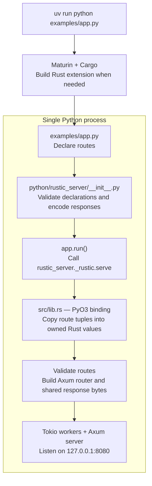

# Architecture

Python declares routes and calls Rust directly. Both run in one process through a PyO3 native extension.

## Build and startup



There is no generated configuration file or separate server command. JSON exists only as the response format. Python remains loaded for the process lifetime; Rust workers own request handling.

## Request handling and shutdown

```mermaid
sequenceDiagram
    participant Python as Python main thread
    participant Binding as PyO3 binding
    participant Rust as Rust / Tokio / Axum
    participant Client as HTTP client

    Python->>Binding: app.run() passes route tuples
    Binding->>Rust: Validate routes, bind socket, start server
    Note over Python,Binding: Release GIL while waiting; check Python signals every 100 ms
    Client->>Rust: HTTP request
    Rust->>Rust: Match path and method
    Rust-->>Client: Cached JSON response, or 404 / 405
    Note over Rust,Client: HEAD omits body; no Python callback per request
    Python->>Binding: Ctrl-C detected through Python signal check
    Binding->>Rust: Request graceful shutdown
    Rust-->>Binding: Connections finish (up to 5 seconds)
    Binding-->>Python: Return through handled KeyboardInterrupt
```

## Directory map

| Path | Purpose |
| --- | --- |
| `examples/app.py` | User entry point: declare endpoints, call `app.run()`. |
| `python/rustic_server/__init__.py` | Python DSL and native server invocation. |
| `src/lib.rs` | Rust extension, routing, and server lifecycle. |
| `src/tests.rs` | Rust unit tests, compiled only with `cfg(test)`. |
| `pyproject.toml` / `uv.lock` | Python package, Maturin build settings, dependency lock. |
| `Cargo.toml` / `Cargo.lock` | Rust library configuration and dependency lock. |
| `tests/` | Python DSL and native integration tests. |
| `.venv/` | Generated Python environment. |
| `target/` | Generated Rust build artifacts. |
| `python/rustic_server/_rustic.*` | Generated native library used by the editable Python package. |

## Current boundary

Supported operations return static JSON. Arbitrary Python request handlers and background jobs are not implemented. To change routes, edit Python declarations and restart the entry point. Performance remains unmeasured.
