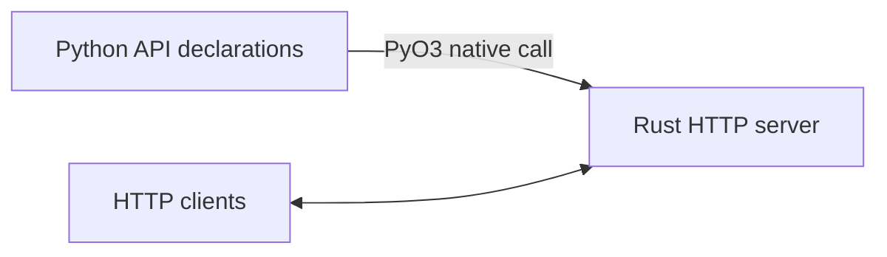

# rustic-server

### Write API routes in Python. Handle requests in Rust.

rustic-server is an early-stage project for defining static JSON routes in Python and serving them with Rust in the same process. PyO3 passes the routes to Rust at startup; Rust handles requests without calling Python for each one.

Try the example and, if it’s useful, give the repo a star. Contributions and benchmark feedback are welcome.

It currently serves static JSON responses. Benchmark results come from one local setup and may differ on other machines.

See [Architecture](ARCHITECTURE.md) for diagrams and directory map.

## Architecture



## Benchmark snapshot

| Server | Requests/s¹ | CPU² | RAM² |
| --- | ---: | ---: | ---: |
| rustic-server | 117,729 | 2.5% | 17.3 MiB |
| Flask | 1,956 | 38.2% | 63.0 MiB |
| Django | 1,894 | 37.8% | 68.3 MiB |

¹ Throughput at 32 concurrent connections. ² CPU and mean RSS at 500 requests/s, measured separately. CPU 100% = one core. Local static JSON test; medians of three trials, with one server worker per framework. These numbers reflect this setup, not general framework performance. See the [full report](benchmarks/results-portable/REPORT.md) and [benchmark instructions](benchmarks/README.md).

## Intent

Use Python as a simple API declaration DSL with Rust handling HTTP for low CPU usage, low memory usage, and low latency.

`app.run()` calls a Rust native extension directly through PyO3. Routes cross into Rust once, in memory. Tokio and Axum run in the same process. Python stays loaded, but HTTP requests execute entirely in Rust.

## Quick start

Requires uv and a current stable Rust toolchain (Cargo).

```sh
uv run python examples/app.py
```

uv builds the Rust extension through Maturin and Cargo on first run. Subsequent runs reuse the build unless build inputs change. Initial compilation takes longer than server startup.

```sh
curl -i http://127.0.0.1:8080/health
```

## Declare and run an API

```python
from rustic_server import App

app = App()
app.get("/health", json={"status": "ok"})
app.route("POST", "/accepted", json={"accepted": True}, status=202)

if __name__ == "__main__":
    app.run(host="127.0.0.1", port=8080)
```

`app.run()` blocks until Ctrl-C and must run on Python's main thread. Rust releases the GIL while waiting, checks Python signals periodically, and allows up to five seconds for connections to finish during shutdown. Bind errors propagate as Python exceptions. `host` accepts an IPv4 or IPv6 address.

## Initial scope

- Static JSON responses with configurable status codes.
- Exact paths and GET, POST, PUT, PATCH, DELETE, OPTIONS methods.
- GET routes support HEAD; unknown paths return 404, unsupported methods return 405.
- Declaration validation and native validation at startup.
- JSON encoded during declaration, stored as shared response bytes in Rust.

Edit declarations and restart the Python entry point to apply changes. Arbitrary Python handlers, dynamic operations, background jobs, authentication, TLS, database operations, and production resource limits are not implemented.

## Development

```sh
uv run python -m unittest discover -s tests
cargo test
cargo fmt --check
```

`pyproject.toml` configures uv and Maturin. `Cargo.toml` configures the native Rust library. uv tracks Rust sources and Cargo manifests for rebuilds. The default Maturin package build uses release optimizations.
